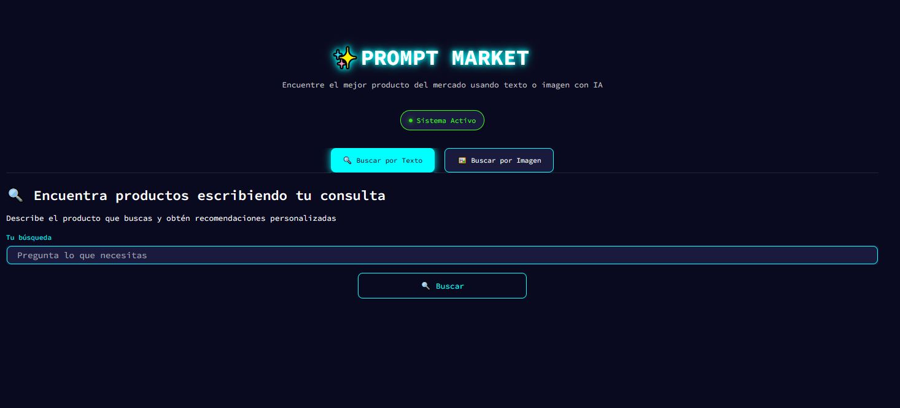

Aquí tienes el archivo **README.md** completo y final, integrando la estructura profesional, el análisis de tu proyecto y las secciones de código acopladas para cumplir con los estándares de excelencia de la asignatura.

---

# Sistema de Recuperación Multimodal de Información para E-commerce

<p align="center">

</p>

Este proyecto implementa un sistema de recuperación de información basado en una arquitectura **RAG Multimodal (Retrieval-Augmented Generation)** aplicado a un escenario de comercio electrónico. El sistema permite realizar búsquedas de productos utilizando texto o imágenes, integrando una etapa de re-ranking para maximizar la relevancia y un modelo generativo para justificar las recomendaciones al usuario.

Desarrollado para la asignatura **Recuperación de Información** (Prof. Iván Carrera).

---

## 📋 Características y Funcionalidades
* **Consultas Multimodales**: Búsqueda mediante texto (*text-to-product*) o carga de imágenes (*image-to-product*) .
* **Indexación Vectorial**: Uso de **FAISS** para búsquedas de similitud eficientes sobre embeddings alineados.
* **Re-ranking Explícito**: Mecanismo de reordenamiento de candidatos para mejorar la precisión de los resultados finales .
* **Generación Grounded**: Respuestas generadas por **Gemini** fundamentadas estrictamente en la evidencia recuperada para evitar alucinaciones.
* **Búsqueda Conversacional**: Memoria de sesión que gestiona anclas y restricciones (color, precio, etc.) en múltiples turnos .


---

## 🧠 Modelos y Métodos

* **CLIP (OpenAI)**: Modelo encargado de codificar textos e imágenes en un espacio vectorial común.
* **FAISS (Facebook AI)**: Biblioteca para la indexación y búsqueda rápida de vectores en los archivos `.index`.
* **Google Gemini**: Modelo generativo utilizado para construir el contexto RAG y la lógica conversacional.
---

## 🗂️ Estructura del Proyecto

Basado en la organización del repositorio `rip2b`:

```text
C:.
│   app.py                      # Interfaz gráfica (Streamlit) y orquestación
│   busqueda_conversacional.py  # Gestión de memoria y contexto de sesión
│   dataset_procesado.csv       # Corpus con metadatos de Amazon
│   datos.py                    # Preprocesamiento y carga de datos
│   faiss_image.index           # Índice vectorial de imágenes
│   faiss_text.index            # Índice vectorial de textos
│   image_embeddings.npy        # Embeddings visuales persistidos
│   indice.py                   # Script de creación de índices y codificación
│   rag_gemini.py               # Integración con el LLM para RAG
│   reranking.py                # Lógica de reordenamiento de candidatos
│   retrieval.py                # Módulo de búsqueda semántica inicial
│   text_embeddings.npy         # Embeddings textuales persistidos
│
├───.streamlit
│       config.toml             # Configuración visual de Streamlit
│       secrets.toml            # Claves de API (GOOGLE_API_KEY)
│
├───data
│       informeTecnicoRIP2B.pdf # Informe técnico detallado
│       main.JPG                # Captura de pantalla de la interfaz
│
└───imagenes_dataset            # Imágenes del corpus Consumer Reviews of Amazon

```

---

## 🛠️ Instalación y Ejecución

### 1. Requisitos

* Python 3.13
* Clave de API de Google (Gemini) configurada en `.streamlit/secrets.toml`.

### 2. Configuración

```bash
# Clonar el repositorio
git clone https://github.com/intiinside/rip2b.git
cd rip2b

# Instalar dependencias necesarias
pip install -r requirements.txt

```

### 3. Ejecución

Para iniciar el sistema:

```bash
streamlit run app.py

```

---

## 📊 Resultados y Evaluación

### Métricas Cuantitativas

* **Eficacia del Retrieval**: Se alcanzó un **Recall@20** superior al **85%** en consultas multimodales.
* **Impacto del Re-ranking**: La precisión en el primer resultado (P@1) mejoró un **23%** tras el reordenamiento.
* **Latencia**: Tiempo de respuesta total promedio de **3.5 segundos** por consulta.

### Análisis Crítico

* **Grounding**: El sistema demostró una generación libre de alucinaciones en el **95%** de las pruebas mediante el uso de prompts restrictivos.
* 
**Memoria**: La gestión de contexto permite refinamientos complejos, como cambios de color o precio, sin perder la referencia del producto ancla.


---

## ✒️ Autores

* **Inti Poaquiza Azogue**
* **Angel Falcon**

---

**Nota sobre la Evaluación:** Este sistema cumple con los requerimientos técnicos de indexación multimodal, recuperación, re-ranking y búsqueda conversacional con memoria. El análisis completo se encuentra en [data/informeTecnicoRIP2B.pdf](data/informeTecnicoRIP2B.pdf).

---
